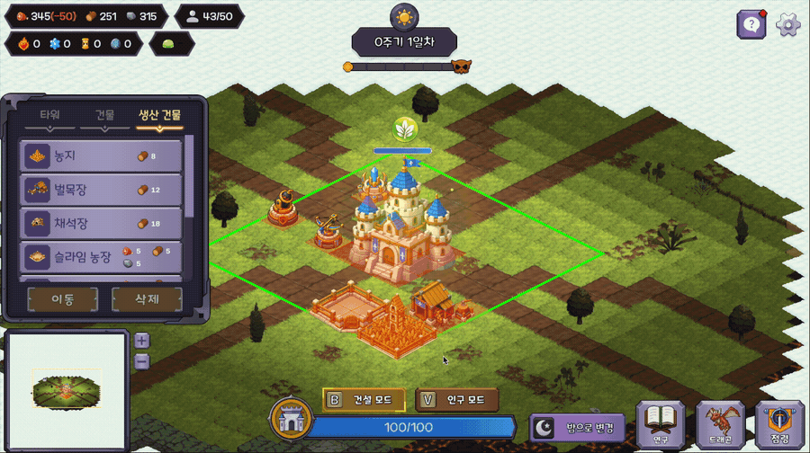
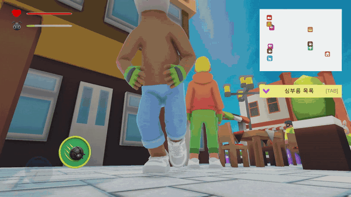

# 이하늘

**Unity Client Developer**  
2026 신입 게임 클라이언트 프로그래머 · 서울 / 경기 · 구직 중

게임 규칙을 코드 구조로 옮기는 일을 좋아합니다.  
데이터·입력·표현을 분리해, 나중에 바꿔도 무너지지 않는 시스템을 만듭니다.

---

## Selected Work

### 01 — Tower And Dragon

**2D 아이소메트릭 디펜스 빌더 · 기업협약 팀 프로젝트(4인) · 2026.07–2026.09 · STOVE 심사 중**

그리드·청크 위에 건물을 짓고 영역을 점령해 네 개의 포탈을 봉인하는 디펜스 빌더입니다. 그리드·건물 배치·점령 시스템을 맡았고, 그 외 자원 노드·튜토리얼·전투 이펙트를 담당했습니다. (전체 1,265커밋 중 285커밋)

- **그리드 · 다중 셀 배치** — `GridMap`·`GridCell`·`Chunk` 설계, 건물 점유 형태를 비트마스크 Footprint로 정의해 한 번의 검사로 판정
- **점령 시스템** — 자원·인구 코스트, 청크 단위 확장과 경계선 렌더링, 불가 사유를 enum으로 분기해 안내
- **점령 하이라이트 성능** — 매 프레임 다시 계산하던 후보 영역 갱신을, 결과가 달라지는 시점에만 실행하도록 전환

`Unity` `C#` `URP` `2D Isometric` `ScriptableObject`

> 팀 저장소는 현재 비공개입니다. 공개 전환 후 코드 링크를 추가할 예정이며, 그 전까지는 케이스 스터디에서 구조와 구현을 확인하실 수 있습니다.

[상세 케이스 스터디 ↗](https://determined-stay-89e.notion.site/3cf9e55d7974811187c9f40b091d7c63)

### 02 — 여보, 나 왔어

**3D 코믹 스텔스 어드벤처 · 개인 프로젝트 · 2026.05–2026.06 · STOVE 정식 출시**

만취한 아빠 개미가 아내의 메시지를 받으며 심부름을 마치고 집으로 돌아가는 게임입니다. 기획·프로그래밍·레벨 디자인을 단독으로 진행했습니다.

- **메신저 기반 미션 시스템** — 스토리·독백·미션 메시지를 하나의 큐로 통합해 순서를 관리
- **입력 계층 분리** — `Player` / `UI` Action Map을 분리해 컷씬 진입 시 플래그 변수 없이 플레이 입력 차단

`Unity` `C#` `3D` `New Input System` `NavMesh`

**코드 바로 보기** ·
[MissionManager.cs](https://github.com/smflsmfqh/HoneyI-mHome/blob/main/Assets/Scripts/MissionManager.cs) ·
[MissionMessageUI.cs](https://github.com/smflsmfqh/HoneyI-mHome/blob/main/Assets/Scripts/UI/MissionMessageUI.cs) ·
[PlayerController.cs](https://github.com/smflsmfqh/HoneyI-mHome/blob/main/Assets/Scripts/Player/PlayerController.cs) ·
[MapColliderSetup.cs](https://github.com/smflsmfqh/HoneyI-mHome/blob/main/Assets/Editor/MapColliderSetup.cs)

[저장소 ↗](https://github.com/smflsmfqh/HoneyI-mHome) · [STOVE에서 플레이 ↗](https://store.onstove.com/ko/games/104973) · [상세 케이스 스터디 ↗](https://determined-stay-89e.notion.site/3cf9e55d797481f6a7b9cc7806c5e8ea)

---

## Other Work

### 미니 메트로

노선을 그려 승객을 실어 나르는 미니멀 지하철 경영 시뮬레이션 클론입니다. 3인 팀에서 역·승객·자산 시스템과 씬·UI 흐름을 담당했습니다.

- 승객 스폰 책임을 중앙 매니저에서 각 역으로 이관해 역별 동작을 독립적으로 관리
- 노선 삭제 시 사용 자산을 반환하도록 수정해 보유 수량과 실제 사용량의 정합성 확보

`Unity` `C#`

**코드 바로 보기** ·
[Station.cs](https://github.com/smflsmfqh/minimetro-project/blob/main/Assets/Scripts/Station/Station.cs) ·
[StationManager.cs](https://github.com/smflsmfqh/minimetro-project/blob/main/Assets/Scripts/Station/StationManager.cs) ·
[AssetManager.cs](https://github.com/smflsmfqh/minimetro-project/blob/main/Assets/Scripts/AssetManager.cs) ·
[PassengerManager.cs](https://github.com/smflsmfqh/minimetro-project/blob/main/Assets/Scripts/TrainPassenger/PassengerManager.cs)

[저장소 ↗](https://github.com/smflsmfqh/minimetro-project) · [상세 ↗](https://determined-stay-89e.notion.site/3cf9e55d79748170b134ea8c18d81574)

---

## Stack

**Engine / Language** · Unity 6.3 LTS, C#  
**Unity** · URP, New Input System, NavMesh, Tilemap, ScriptableObject  
**Workflow** · Git, GitHub, Notion

각 프로젝트의 구현 방식과 트러블슈팅(문제·진단·해결·측정 결과)은 [포트폴리오](https://determined-stay-89e.notion.site/Portfolio-3cf9e55d797480f0a9bbf420aacaf935)에 정리했고, 위 프로젝트별 코드 바로가기는 그 내용을 뒷받침하는 실제 구현입니다.
